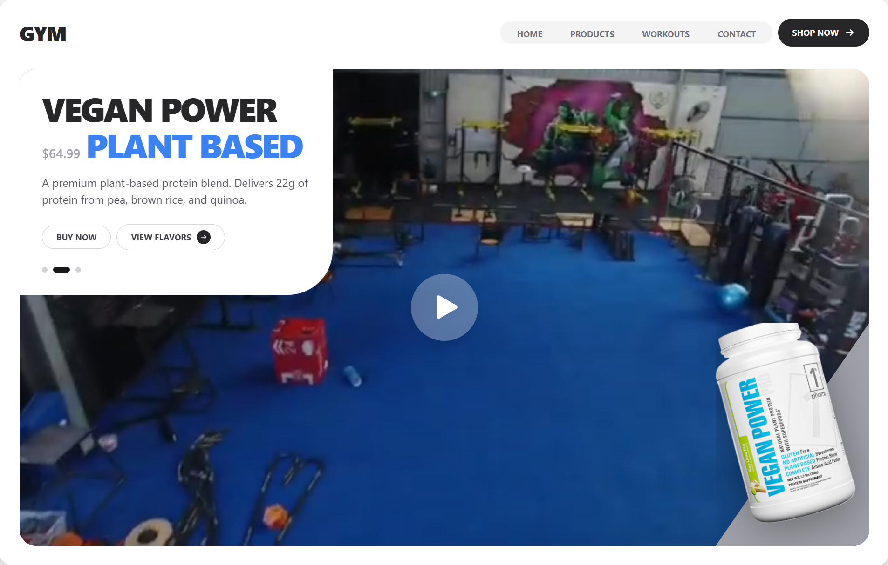

# Vigor Nutrition - Interactive Product Landing Page



A stunning and highly interactive frontend concept for "Vigor Nutrition," a fictional fitness supplement brand. This project is a showcase of modern web design and development techniques, focusing on creating a fluid, engaging, and visually rich user experience. It's built entirely on the frontend using React and Tailwind CSS, demonstrating what's possible without a backend.

---

## ✨ Key Features

*   **Interactive Product Carousel:** Smooth, swipeable horizontal scroller to browse different products.
*   **Dynamic Content Updates:** Product details (name, price, description) animate and update seamlessly as you scroll through the carousel.
*   **Immersive "Theater Mode":** A single click expands the background video to fill the entire screen, hiding UI elements for a cinematic, distraction-free view.
*   **Advanced Animations & Transitions:** Custom cubic-bezier curves and transform effects create a polished feel for product images, side panels, and navigation elements.
*   **Unique UI Design:** Features an asymmetric layout with a striking triangular panel and overflowing product images for a modern, layered look.
*   **Hover-Activated Controls:** Sleek navigation arrows appear gracefully on hover for intuitive carousel control.

---

## 🛠️ Tech Stack

*   **Framework:** [React](https://reactjs.org/)
*   **Styling:** [Tailwind CSS](https://tailwindcss.com/) (via CDN)
*   **Language:** TypeScript
*   **Icons:** [Heroicons](https://heroicons.com/)

---

## 🚀 Getting Started

This is a static frontend project and does not require a complex build process.

### Prerequisites

You'll need a simple local web server to run this project and avoid potential CORS issues when serving files locally. [Node.js](https://nodejs.org/) is recommended, as it gives you access to `npx`.

### Running Locally

1.  Clone this repository or download the project files.
2.  Create an `/assets` folder in the root of the project and download the necessary media files. You will need to save the product images from the links and download the YouTube video as an MP4.
    *   **`assets/1.png`**
    *   **`assets/2.png`**
    *   **`assets/3.png`**
    *   **`assets/video.mp4`**
3.  Open your terminal in the project's root directory.
4.  Run a simple web server. For example, using the `serve` package:
    ```bash
    npm install
    npm run dev
    ```
5.  Open your browser and navigate to the local address provided by the server.

---

## 🖼️ Asset Credits

The beautiful product images and background video are sourced from the following creators and brands. Please note that these are used for demonstration purposes only.

*   **Product 1 (Whey Pro Max):** Image sourced from (https://bodycruz.com.br/products/whey-pro-1kg-refil-max-titanium).
*   **Product 2 (Vegan Power):** Image sourced from (https://1stphorm.com/products/vegan-power-pro).
*   **Product 3 (ISO-XTREM):** Image sourced from (https://fixsante.com/product/iso-xtrem-1lbs-vanille/).
*   **Background Video:** Sourced from (https://www.youtube.com/watch?v=zBNWTaCy6_4).

---

## ℹ️ Frontend-Only Project

Please note: This is a **frontend-only** application. All data is hardcoded within the components. There is no backend, database, or API communication. Its purpose is purely to demonstrate UI/UX design and frontend development skills.
